# NovaCart AI Customer Support & Ticket Automation System

[](https://www.python.org/)
[](https://fastapi.tiangolo.com/)
[](https://github.com/langchain-ai/langgraph)
[](https://groq.com/)
[](https://www.trychroma.com/)
[](https://react.dev/)
[](https://vitejs.dev/)

An enterprise-grade, agentic AI customer support system designed for modern e-commerce. **NovaCart AI** combines **Retrieval-Augmented Generation (RAG)**, autonomous **LangGraph ReAct agent orchestration**, **multi-tool calling**, **stateful conversation memory**, **automated anomaly detection**, and **human escalation** with a high-performance **FastAPI** backend and an intuitive **React** real-time dashboard.

---

## Table of Contents

- [1. Project Overview](#1-project-overview)
- [2. Problem Statement](#2-problem-statement)
- [3. Objectives](#3-objectives)
- [4. Features](#4-features)
- [5. Technology Stack](#5-technology-stack)
- [6. System Architecture](#6-system-architecture)
- [7. Application Workflow](#7-application-workflow)
- [8. RAG Architecture](#8-rag-architecture)
- [9. Agent Workflow](#9-agent-workflow)
- [10. Tool Documentation](#10-tool-documentation)
- [11. Conversation Memory](#11-conversation-memory)
- [12. API Documentation](#12-api-documentation)
- [13. Installation](#13-installation)
- [14. Environment Variables](#14-environment-variables)
- [15. Running Instructions](#15-running-instructions)
- [16. Testing](#16-testing)
- [17. Error Handling](#17-error-handling)
- [18. Known Limitations](#18-known-limitations)
- [19. Future Improvements](#19-future-improvements)

---

## 1. Project Overview

**NovaCart AI Customer Support & Ticket Automation System** is an end-to-end intelligent customer service platform built to automate Tier-1 support workflows while maintaining human-in-the-loop governance for complex edge cases.

Unlike static rule-based chatbots, NovaCart AI operates as an **autonomous agent** capable of reasoning, inspecting knowledge-base documentation, querying live transactional databases (orders, deliveries, and payment gateways), creating persistent support tickets, and automatically escalating anomalies to human supervisors.

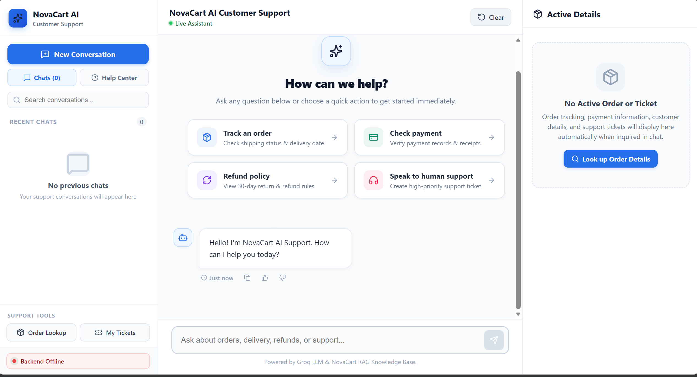

### Key Value Propositions
* **Zero Policy Hallucination**: Strict grounding over store policies using vector semantic search and lexical fallback.
* **Live System Integration**: Direct real-time read/write access to order management and ticketing databases.
* **Autonomous Anomaly Detection**: Proactively identifies billing discrepancies (e.g., money deducted for a failed order) and triggers high-priority escalation without customer prompt engineering.
* **Context-Aware Visual Interface**: Interactive side-panel context cards displaying live order tracking, payment cards, customer profiles, and escalation alerts.

---

## 2. Problem Statement

Modern e-commerce platforms handle thousands of repetitive support queries daily across returns, shipping timelines, cancellations, and order tracking. Traditional customer service architectures suffer from critical bottlenecks:

1. **Static Chatbots & Rigid Rule Engines**: Incapable of understanding nuanced phrasing, resolving multi-turn pronouns ("when will *it* arrive?"), or adapting to context.
2. **Generative LLM Hallucinations**: Standard LLMs invent return windows, shipping guarantees, or non-existent discounts when not strictly grounded in company policy.
3. **Data Silos**: Support agents and chatbots lack direct, synchronized access to transactional databases (SQL order records, payment provider statuses, and logistics tracking).
4. **Inefficient Escalation Paths**: Edge cases—such as payment captured but order generation failed—often require prolonged customer explanation and manual ticket routing, damaging customer trust.
5. **Session Disconnection**: Traditional bots forget previous turns within the same conversation, forcing users to repeatedly type order numbers and contact information.

---

## 3. Objectives

* **Automate 70%+ of Tier-1 Support**: Resolve general FAQ inquiries, shipping questions, and order lookups instantly without human agent intervention.
* **Guarantee Policy Compliance**: Enforce strict prompt boundaries and semantic retrieval so answers are 100% grounded in authorized NovaCart documentation.
* **Enable Dynamic Tool Execution**: Provide the agent with safe, schema-validated tools for checking orders, tracking courier packages, checking payment transactions, and logging support tickets.
* **Implement Intelligent Auto-Escalation**: Detect business logic discrepancies and customer distress signals, automatically provisioning support tickets and alerting human teams.
* **Provide Stateful Session Memory**: Maintain context across multi-turn dialogues with coreference resolution and persistent audit logs in relational storage.
* **Deliver an Enterprise UI/UX**: Provide an interactive React dashboard with glassmorphism aesthetics, live tool execution indicators, conversation history, and real-time context synchronization.

---

## 4. Features

### Core Capabilities Matrix

| Feature | Description | Highlight |
| :--- | :--- | :--- |
| **Agentic Reasoning (ReAct)** | LangGraph-powered loop that reasons over user intent, selects tools, evaluates output, and responds. | Groq-accelerated low-latency inferences. |
| **Grounded Knowledge Base (RAG)** | Ingests store policies (Markdown), splits chunks, and retrieves relevant context via vector similarity. | Pure-Python lexical fallback for zero-downtime search. |
| **Real-Time Order Tracking** | Fetches live order status, courier provider, tracking code, and estimated delivery dates from SQLite. | Synchronizes with UI Order Context Card in real time. |
| **Payment Status Verification** | Inspects payment records to verify captured, pending, failed, or refunded transactions. | Direct verification against transaction records. |
| **Automated Support Ticketing** | Autonomously provisions tickets with customer ID, order ID, priority level, and detailed issue descriptions. | Persistent SQL records accessible in the Ticket Management view. |
| **Automated Anomaly Escalation** | Recognizes critical operational inconsistencies (e.g., payment `Captured` + order `Failed`). | Displays red Escalation Alert Card and assigns ticket priority `high`. |
| **Multi-Turn Pronoun Memory** | Resolves pronouns like *"it"*, *"that item"*, or *"my package"* across conversational turns using LangGraph checkpoints. | Seamless continuity across extended dialogue sessions. |
| **Full Conversation Persistence** | Stores every conversation session and individual message in SQLite with metadata, tool calls, and user feedback. | Enables chat history browsing and auditing. |

### Ticket Management & History
Customers and support personnel can view open tickets, issue severity, timestamps, and escalation statuses directly from the web interface:

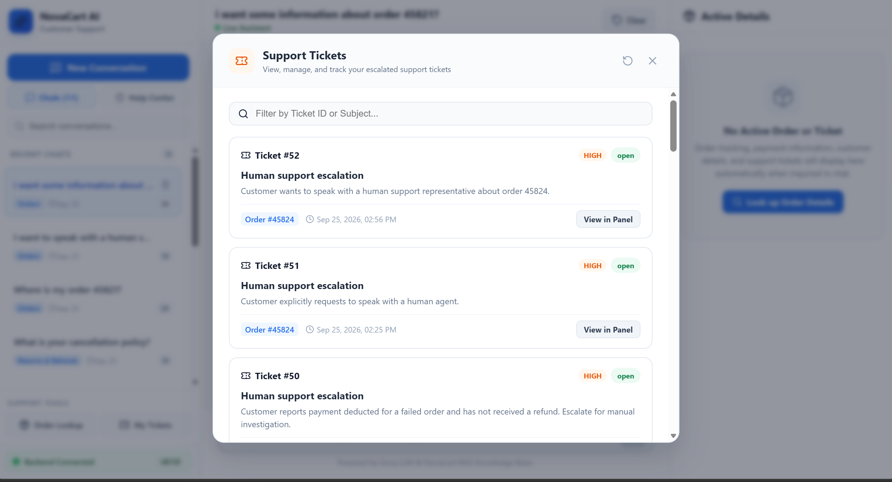

---

## 5. Technology Stack

### Architecture Stack Breakdown

```
┌─────────────────────────────────────────────────────────────┐
│                       Frontend Layer                        │
│            React 19 • Vite • Lucide Icons • CSS Modules     │
└──────────────────────────────┬──────────────────────────────┘
                               │ HTTP / JSON REST
┌──────────────────────────────▼──────────────────────────────┐
│                    API & Service Layer                      │
│     FastAPI • Uvicorn • Pydantic v2 • SQLAlchemy 2.0 ORM    │
└──────────────┬───────────────────────────────┬──────────────┘
               │                               │
┌──────────────▼──────────────┐ ┌──────────────▼──────────────┐
│    Agentic Reasoning Core   │ │    Retrieval & Data Store   │
│ • LangGraph StateGraph      │ │ • ChromaDB Vector Store     │
│ • Groq LLM (Llama-3.3-70B)  │ │ • HuggingFace MiniLM-L6-v2  │
│ • LangChain Tools           │ │ • SQLite Database (support) │
│ • MemorySaver Checkpointer  │ │ • Markdown Knowledge Base   │
└─────────────────────────────┘ └─────────────────────────────┘
```

* **Core & Backend Framework**:
  * [Python 3.10+](https://www.python.org/)
  * [FastAPI](https://fastapi.tiangolo.com/): Asynchronous REST API framework with automated OpenAPI/Swagger generation.
  * [Uvicorn](https://www.uvicorn.org/): High-performance ASGI web server.
  * [Pydantic v2](https://docs.pydantic.dev/): Strict data validation, request/response schemas, and environment configuration.
* **AI & Agent Orchestration**:
  * [LangGraph](https://github.com/langchain-ai/langgraph): Cyclical state-machine graph for agentic reasoning, tool calling, and checkpoint persistence.
  * [LangChain](https://www.langchain.com/): LLM abstraction, tool schemas, and document processing pipelines.
  * [LangChain Groq](https://github.com/langchain-ai/langchain-groq): Ultra-low latency inference client utilizing Groq LPU hardware (`llama-3.3-70b-versatile` / `openai/gpt-oss-20b`).
* **Vector Storage & Embeddings (RAG)**:
  * [ChromaDB](https://www.trychroma.com/): Embedded vector database for semantic chunk retrieval.
  * [HuggingFace Embeddings](https://huggingface.co/sentence-transformers/all-MiniLM-L6-v2): Local `sentence-transformers/all-MiniLM-L6-v2` (384-dimensional dense vectors on CPU).
  * [LangChain Text Splitters](https://python.langchain.com/docs/modules/data_connection/document_transformers/): Recursive character text chunking with markdown header awareness.
* **Database & ORM**:
  * [SQLite](https://www.sqlite.org/): ACID-compliant embedded database (`data/support.db`).
  * [SQLAlchemy 2.0](https://www.sqlalchemy.org/): Declarative ORM models for customers, orders, payments, tickets, conversations, and messages.
* **Frontend**:
  * [React 19](https://react.dev/): Component-driven user interface.
  * [Vite](https://vitejs.dev/): Next-generation frontend build tooling.
  * [Lucide React](https://lucide.dev/): Modern iconography.
  * Modern CSS: Custom responsive design system featuring glassmorphism, fluid typography, and dark/light color accents.
* **Testing & Quality Assurance**:
  * [Pytest](https://docs.pytest.org/): Unit, integration, and scenario testing.
  * [HTTPX](https://www.python-httpx.org/): Async HTTP client for integration test suites.

---

## 6. System Architecture

The system is organized into modular layers adhering to separation of concerns:

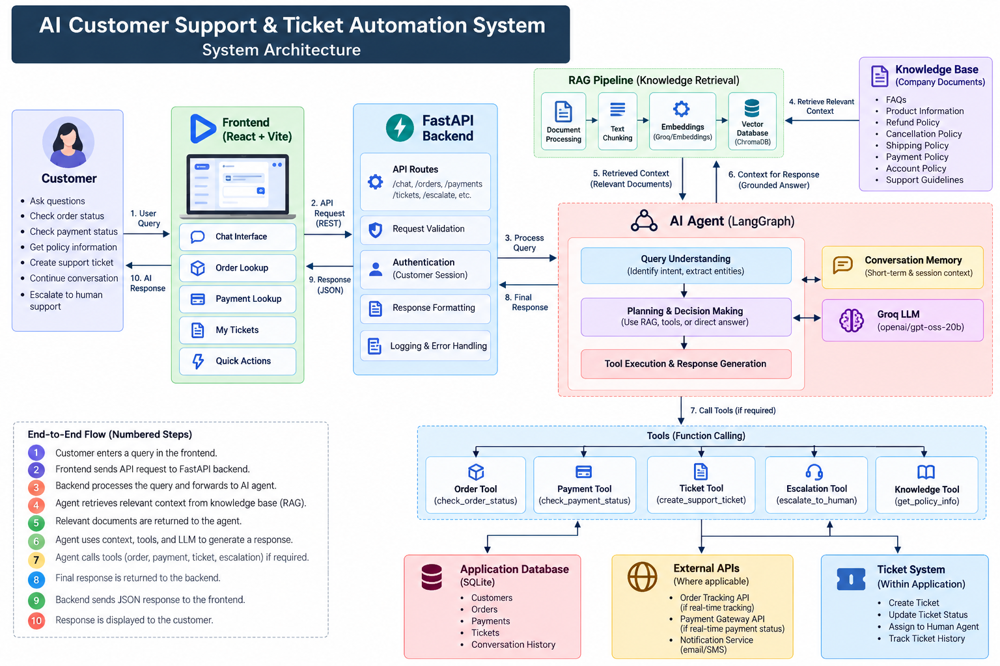

### 1. Presentation Layer (Frontend)
Built with React and Vite. Communicates with the backend over REST endpoints (`/chat`, `/conversations`, `/orders`, `/tickets`). Manages active thread IDs, renders message streams, shows tool execution indicators, and updates live context panels.

### 2. API Gateway & Routing Layer (FastAPI)
* `app/main.py`: Entrypoint initializing database schemas, configuring CORS middleware, and registering domain routers.
* Routers:
  * `/chat`: Primary agent endpoint orchestrating conversation persistence and LangGraph execution.
  * `/orders`: Direct order queries.
  * `/payments`: Payment transaction lookup.
  * `/tickets`: Ticket creation, listing, and inspection.
  * `/escalation`: Direct human escalation handling.
  * `/conversations`: Historical session retrieval, creation, deletion, and feedback logging.
  * `/health`: System and database connectivity monitoring.

### 3. Agent & Reasoning Layer (LangGraph)
* `app/agent/graph.py`: Defines the `StateGraph` state machine with `START`, `agent` node, `ToolNode`, and `END`.
* `app/agent/nodes.py`: Invokes the Groq LLM with the consolidated system prompt, user messages, and tool definitions.
* `app/agent/prompts.py`: System instructions establishing anti-hallucination guardrails, escalation triggers, and tool rules.
* `app/agent/state.py`: Typed dictionary maintaining message histories.

### 4. Knowledge & Data Storage Layer
* **Vector Store**: ChromaDB index storing chunked embeddings of store policies.
* **Relational Database (`support.db`)**: Managed via SQLAlchemy ORM models:
  * `Customer`: User credentials and profiles.
  * `Order`: Product details, order status, amounts, tracking codes, and delivery dates.
  * `Payment`: Payment status (`Captured`, `Failed`, `Refunded`), amounts, and timestamps.
  * `Ticket`: Support issues, priorities, subjects, and statuses.
  * `Conversation`: Session ID, title, category, status, and linked customer.
  * `Message`: Sender, content, creation timestamp, and serialized metadata.

#### Relational Database Entity Views
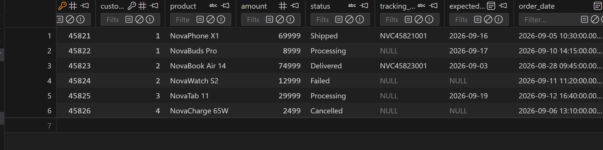
*Figure: Customers and Orders tables maintaining core customer profiles and delivery data.*

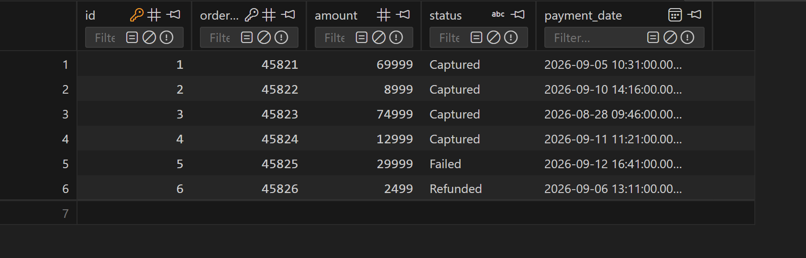
*Figure: Payments and Support Tickets tables capturing financial records and ticket issues.*

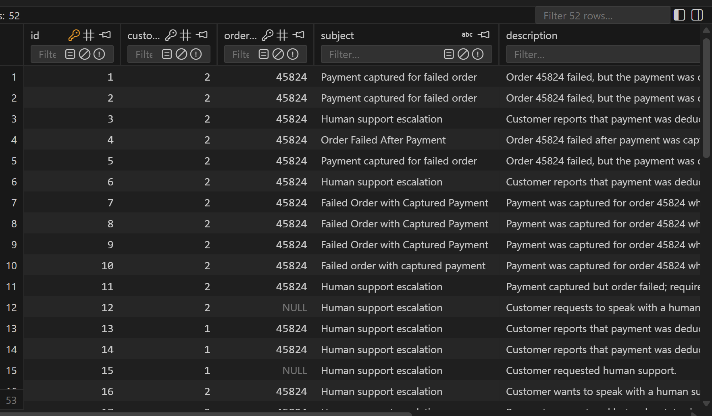
*Figure: Conversations and Messages tables providing full audit trails and metadata logging.*

---

## 7. Application Workflow

The diagram below details the execution lifecycle of a customer message through the system:

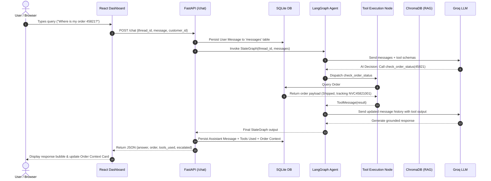
```mermaid
sequenceDiagram
    autonumber
    actor Customer as User / Browser
    participant UI as React Dashboard
    participant API as FastAPI (/chat)
    participant DB as SQLite DB
    participant Agent as LangGraph Agent
    participant Tools as Tool Execution Node
    participant KB as ChromaDB (RAG)
    participant LLM as Groq LLM

    Customer->>UI: Types query ("Where is my order 45821?")
    UI->>API: POST /chat {thread_id, message, customer_id}
    API->>DB: Persist User Message to 'messages' table
    API->>Agent: Invoke StateGraph(thread_id, messages)
    Agent->>LLM: Send messages + tool schemas
    LLM-->>Agent: AI Decision: Call check_order_status(45821)
    Agent->>Tools: Dispatch check_order_status
    Tools->>DB: Query Order #45821
    DB-->>Tools: Return order payload (Shipped, tracking NVC45821001)
    Tools-->>Agent: ToolMessage(result)
    Agent->>LLM: Send updated message history with tool output
    LLM-->>Agent: Generate grounded response
    Agent-->>API: Final StateGraph output
    API->>DB: Persist Assistant Message + Tools Used + Order Context
    API-->>UI: Return JSON {answer, order, tools_used, escalated}
    UI-->>Customer: Display response bubble & update Order Context Card
```

---

## 8. RAG Architecture

The Knowledge Retrieval pipeline provides accurate, hallucination-free answers to policy questions.

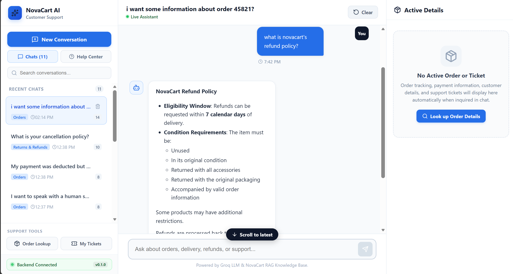
*Figure: Semantic RAG retrieval answering policy questions accurately based on markdown documentation.*

### Pipeline Architecture

```
Knowledge Base (.md)
       │
       ▼
app/rag/loader.py (LangChain Document Loader)
       │
       ▼
app/rag/chunker.py (RecursiveCharacterTextSplitter: 800 chars, 150 overlap)
       │
       ▼
app/rag/embeddings.py (sentence-transformers/all-MiniLM-L6-v2)
       │
       ▼
app/rag/vector_store.py (ChromaDB Collection: novacart_knowledge_base)
       │
       ▼
app/rag/retriever.py (Similarity Search with Lexical Fallback)
       │
       ▼
app/tools/rag_tools.py (search_knowledge_base Tool)
       │
       ▼
Groq LLM (Grounded Context Synthesis)
```

### Knowledge Base Ingestion Documents
The system indexes 8 domain-specific policies located in `knowledge_base/`:
1. `account_policy.md`: Login troubleshooting, password resets, and account verification.
2. `cancellation_policy.md`: Cancellation conditions for pending vs. shipped orders.
3. `customer_support_guidelines.md`: Standard operational procedures and escalation criteria.
4. `faq.md`: Frequently asked logistical and service questions.
5. `payment_policy.md`: Accepted payment methods (UPI, Cards, Net Banking), security, and retry policies.
6. `products.md`: Catalog specifications, pricing, and warranty details.
7. `refund_policy.md`: 7-day return window, condition criteria, and refund timelines.
8. `shipping_policy.md`: Delivery zones, standard (3–5 days) and express options, and courier details.

### Chunking & Embedding Strategy
* **Splitter**: `RecursiveCharacterTextSplitter` configured with `chunk_size=800` and `chunk_overlap=150`.
* **Separators**: Markdown section headers (`\n## `, `\n### `), paragraphs (`\n\n`), newlines, and sentences to preserve document structure.
* **Embeddings**: Local `all-MiniLM-L6-v2` generating 384-dimensional normalized vectors on CPU, eliminating external vector API latency.
* **Metadata Attachment**: Every chunk preserves `source` filename, `file_path`, `file_type`, and incremental `chunk_id`.

### Dual-Mode Retrieval with Resilient Fallback
In enterprise deployments, C-extensions or external vector dependencies may experience platform constraints. `app/rag/retriever.py` implements an automatic dual-mode strategy:
1. **Primary Vector Retrieval**: Performs ChromaDB cosine similarity search (`top_k=4`).
2. **Pure-Python Lexical Fallback**: If vector storage is inaccessible, the system seamlessly activates an in-memory keyword scoring algorithm featuring stop-word removal, header boosting (6.0x weight), and logarithmic term-frequency weighting.

---

## 9. Agent Workflow

The support agent operates as a **LangGraph cyclical StateGraph**, implementing the ReAct (Reason + Act) design pattern.

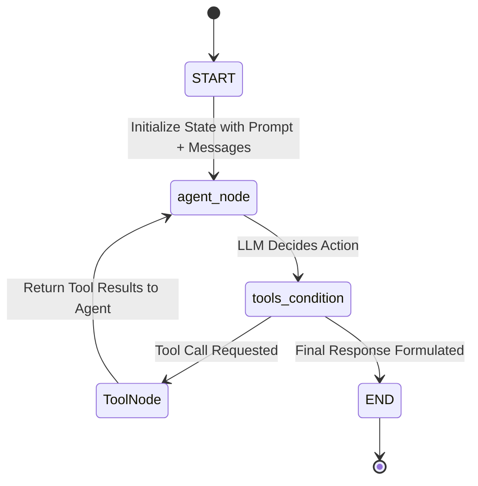
```mermaid
stateDiagram-v2
    [*] --> START
    START --> agent_node: Initialize State with Prompt + Messages
    agent_node --> tools_condition: LLM Decides Action

    state tools_condition <<choice>>
    tools_condition --> ToolNode: Tool Call Requested
    tools_condition --> END: Final Response Formulated

    ToolNode --> agent_node: Return Tool Results to Agent
    END --> [*]
```

### Complex Multi-Tool Reasoning
When handling multifaceted queries, the agent autonomously chains multiple tools. For example, verifying order status and payment records concurrently:

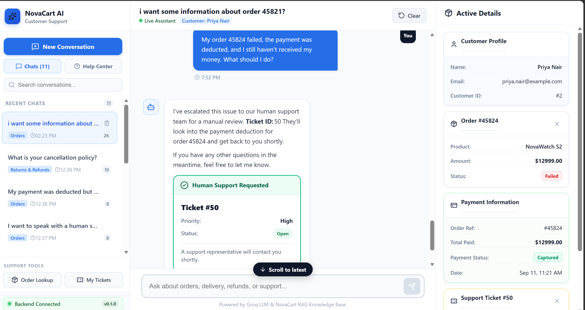
*Figure: Agent executing multiple tools in sequence to evaluate complex customer requests.*

### Automated Anomaly Detection & Human Escalation
A primary innovation of NovaCart AI is its automated business logic verification:

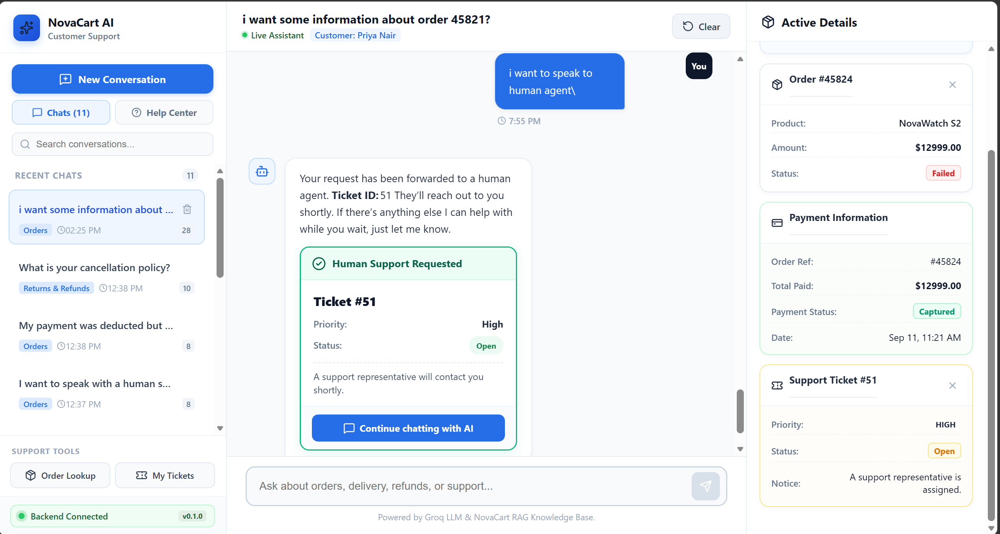
*Figure: Automatic escalation triggered by payment/order status inconsistency.*

1. **Discrepancy Detection**: If a customer reports a charged card for a failed order, the agent calls `check_order_status` and `check_payment_status`.
2. **Anomaly Logic**: When `order.status == 'Failed'` while `payment.status == 'Captured'`, the system identifies an operational fault.
3. **Escalation Trigger**: The agent calls `escalate_to_human`, creating a `high`-priority ticket and marking `escalated: true`.
4. **UI Alert**: The React dashboard displays a dedicated red **Human Escalation Alert Card** detailing the generated ticket ID and next steps.

---

## 10. Tool Documentation

The agent has access to 5 schema-validated tools that interact with the application database and knowledge base:

### 1. `search_knowledge_base`
* **File**: [app/tools/rag_tools.py](file:///c:/Users/Samyu/D%20Drive%28hp%29/Internship/2026/DStarix%20Techno/ai_customer_support_ticket_system/DStarix_ai_customer_support_ticket_system/app/tools/rag_tools.py)
* **Description**: Queries NovaCart's documentation for static company policies, FAQs, product specifications, and shipping/refund rules.
* **Input**:
  ```json
  { "query": "What is the return window for electronics?" }
  ```
* **Output**:
  ```json
  {
    "success": true,
    "results": [
      {
        "source": "refund_policy.md",
        "chunk_id": 4,
        "content": "Customers may return items within 7 calendar days of delivery..."
      }
    ]
  }
  ```

### 2. `check_order_status`
* **File**: [app/tools/order_tools.py](file:///c:/Users/Samyu/D%20Drive%28hp%29/Internship/2026/DStarix%20Techno/ai_customer_support_ticket_system/DStarix_ai_customer_support_ticket_system/app/tools/order_tools.py)
* **Description**: Retrieves live status, product details, total cost, tracking ID, and expected delivery date for a specific order.

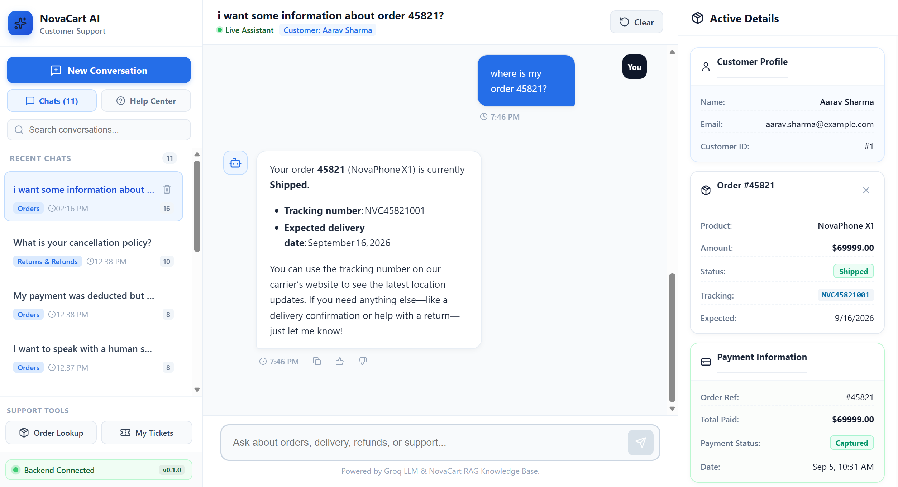

* **Input**:
  ```json
  { "order_id": 45821 }
  ```
* **Output**:
  ```json
  {
    "success": true,
    "order_id": 45821,
    "customer_id": 1,
    "product": "NovaPhone X1",
    "amount": 69999.0,
    "status": "Shipped",
    "tracking_number": "NVC45821001",
    "expected_delivery_date": "2026-09-16"
  }
  ```

### 3. `get_delivery_status`
* **File**: [app/tools/order_tools.py](file:///c:/Users/Samyu/D%20Drive%28hp%29/Internship/2026/DStarix%20Techno/ai_customer_support_ticket_system/DStarix_ai_customer_support_ticket_system/app/tools/order_tools.py)
* **Description**: Retrieves dedicated courier dispatch and tracking metadata for an order.
* **Input**:
  ```json
  { "order_id": 45823 }
  ```
* **Output**:
  ```json
  {
    "success": true,
    "order_id": 45823,
    "customer_id": 2,
    "status": "Delivered",
    "tracking_number": "NVC45823001",
    "expected_delivery_date": "2026-09-03"
  }
  ```

### 4. `check_payment_status`
* **File**: [app/tools/payment_tools.py](file:///c:/Users/Samyu/D%20Drive%28hp%29/Internship/2026/DStarix%20Techno/ai_customer_support_ticket_system/DStarix_ai_customer_support_ticket_system/app/tools/payment_tools.py)
* **Description**: Checks the gateway transaction status (`Captured`, `Pending`, `Failed`, `Refunded`) for an order.

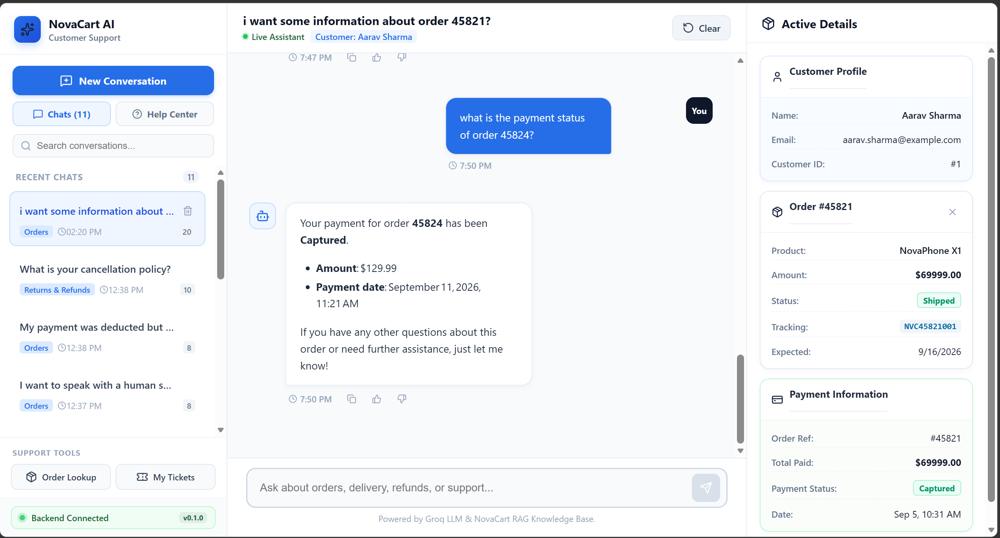

* **Input**:
  ```json
  { "order_id": 45821 }
  ```
* **Output**:
  ```json
  {
    "success": true,
    "payment": {
      "payment_id": 1,
      "order_id": 45821,
      "amount": 69999.0,
      "status": "Captured",
      "payment_date": "2026-09-10T10:30:00"
    }
  }
  ```

### 5. `escalate_to_human`
* **File**: [app/tools/support_tools.py](file:///c:/Users/Samyu/D%20Drive%28hp%29/Internship/2026/DStarix%20Techno/ai_customer_support_ticket_system/DStarix_ai_customer_support_ticket_system/app/tools/support_tools.py)
* **Description**: Creates a support ticket in SQLite and sets `escalated: true`. Automatically resolves customer ID from `order_id` if missing.
* **Input**:
  ```json
  {
    "order_id": 45824,
    "reason": "Payment captured but order status shows Failed",
    "priority": "high"
  }
  ```
* **Output**:
  ```json
  {
    "success": true,
    "escalated": true,
    "ticket_id": 104,
    "customer_id": 2,
    "order_id": 45824,
    "priority": "high",
    "status": "open",
    "reason": "Payment captured but order status shows Failed",
    "message": "Issue successfully escalated to human support. Ticket ID: 104."
  }
  ```

---

## 11. Conversation Memory

The system utilizes a **dual-tier memory architecture** providing both immediate stateful reasoning and long-term conversational auditability.

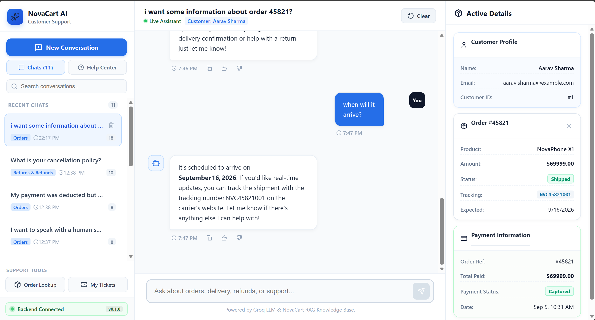
*Figure: Demonstrating coreference resolution across conversational turns within the same thread.*

### 1. In-Graph Working Memory (`MemorySaver`)
* Powered by LangGraph's `MemorySaver` checkpointer.
* Sessions are isolated using unique `thread_id` keys passed in the API payload.
* Enables coreference resolution:
  * **Turn 1**: *"Where is my order 45821?"* -> Agent calls `check_order_status(45821)`.
  * **Turn 2**: *"When will it arrive?"* -> Agent resolves *"it"* to Order #45821 without requesting the ID again.

### 2. Relational Database Persistence (`support.db`)
* Every exchange is logged to `conversations` and `messages` tables:
  * **Conversation**: Tracks session ID, auto-generated title, category, status (`active`, `escalated`), and linked `customer_id` / `order_id`.
  * **Message**: Stores `sender` (`user`, `assistant`), message content, timestamp, and JSON metadata (`tools_used`, `order`, `payment`, `ticket_id`, and user feedback).
* Preserves conversation history across browser reloads.

---

## 12. API Documentation

FastAPI automatically generates interactive Swagger and ReDoc documentation available at:
* Swagger UI: `http://localhost:8000/docs`
* ReDoc UI: `http://localhost:8000/redoc`

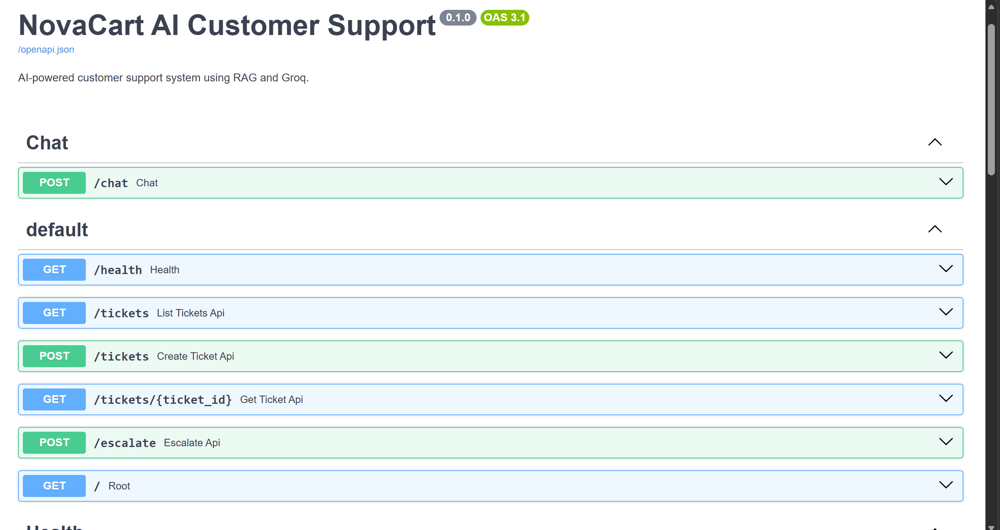
*Figure: OpenAPI Swagger interface displaying Chat, Health, Orders, and Payments endpoints.*

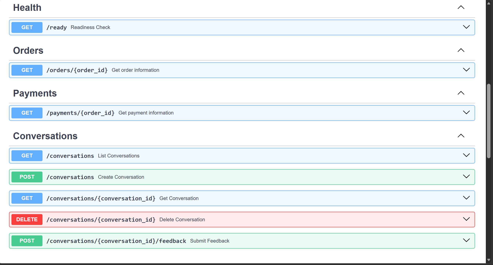
*Figure: OpenAPI Swagger interface displaying Tickets, Escalation, and Conversations endpoints.*

### API Endpoints Reference

| Method | Endpoint | Description | Request Body | Response |
| :---: | :--- | :--- | :--- | :--- |
| `POST` | `/chat` | Core conversational endpoint | `ChatRequest` | `ChatResponse` |
| `GET` | `/health` | System and DB health check | None | Status JSON |
| `GET` | `/orders/{order_id}` | Retrieve order details | None | `OrderResponse` |
| `GET` | `/payments/{order_id}` | Retrieve payment status | None | `PaymentResponse` |
| `GET` | `/tickets` | List recent tickets (filter by customer) | Query params | Ticket Array |
| `POST` | `/tickets` | Create a support ticket | `TicketCreateRequest` | Ticket JSON |
| `GET` | `/tickets/{ticket_id}` | Retrieve single ticket | None | Ticket JSON |
| `POST` | `/escalation` | Direct human escalation endpoint | `EscalationRequest` | Escalation JSON |
| `GET` | `/conversations` | List recent conversation sessions | Query params | Conversation Summaries |
| `GET` | `/conversations/{id}` | Retrieve full message thread | None | `ConversationDetail` |
| `POST` | `/conversations` | Create or initialize conversation | `ConversationCreate` | `ConversationSummary` |
| `DELETE` | `/conversations/{id}` | Delete conversation and messages | None | Confirmation JSON |
| `POST` | `/conversations/{id}/feedback` | Submit message feedback (like/dislike) | `FeedbackRequest` | Status JSON |

### Sample Request: `POST /chat`

```bash
curl -X POST "http://localhost:8000/chat" \
     -H "Content-Type: application/json" \
     -d '{
       "thread_id": "session-101",
       "message": "What is the status of order 45821?"
     }'
```

### Sample Response: `POST /chat`

```json
{
  "answer": "Order #45821 for NovaPhone X1 is currently **Shipped**. It was dispatched with tracking number **NVC45821001** and is expected to arrive on September 16, 2026.",
  "escalated": false,
  "ticket_id": null,
  "order": {
    "order_id": 45821,
    "customer_id": 1,
    "product": "NovaPhone X1",
    "amount": 69999.0,
    "status": "Shipped",
    "tracking_number": "NVC45821001",
    "expected_delivery_date": "2026-09-16"
  },
  "payment": null,
  "tools_used": [
    {
      "name": "check_order_status",
      "args": { "order_id": 45821 }
    }
  ],
  "customer": {
    "id": 1,
    "name": "Aarav Sharma",
    "email": "aarav.sharma@example.com"
  }
}
```

---

## 13. Installation

### Prerequisites
* **Python**: Version `3.10` or higher
* **Node.js**: Version `18.0.0` or higher (with npm)
* **Git**: Version control
* **Groq API Key**: Obtainable from [console.groq.com](https://console.groq.com/)

### Step 1: Clone Repository
```bash
git clone https://github.com/Samyuktha13-06/DStarix_ai_customer_support_ticket_system.git
cd DStarix_ai_customer_support_ticket_system
```

### Step 2: Backend Setup
```bash
# 1. Create a Python virtual environment
python -m venv venv

# 2. Activate virtual environment
# Windows (PowerShell):
.\venv\Scripts\Activate.ps1
# Linux / macOS:
source venv/bin/activate

# 3. Upgrade pip and install dependencies
pip install --upgrade pip
pip install -r requirements.txt
```

### Step 3: Frontend Setup
```bash
cd frontend
npm install
cd ..
```

---

## 14. Environment Variables

### Backend Configuration (`.env`)
Create a `.env` file in the root directory (refer to [.env.example](file:///c:/Users/Samyu/D%20Drive%28hp%29/Internship/2026/DStarix%20Techno/ai_customer_support_ticket_system/DStarix_ai_customer_support_ticket_system/.env.example)):

```ini
# Required: Groq LLM API Key
GROQ_API_KEY=gsk_your_actual_groq_api_key_here

# LLM Model Configuration
GROQ_MODEL=llama-3.3-70b-versatile

# Application Settings
APP_NAME=NovaCart AI Customer Support
APP_ENV=development
LOG_LEVEL=INFO

# Storage Paths
DATABASE_URL=sqlite:///./data/support.db
CHROMA_PERSIST_DIRECTORY=./data/chroma
```

### Frontend Configuration (`frontend/.env`)
Create a `.env` file inside the `frontend/` directory (refer to `frontend/.env.example`):

```ini
VITE_API_BASE_URL=http://localhost:8000
```

---

## 15. Running Instructions

### Step 1: Initialize Database & Ingest Knowledge Base
Before starting the servers, initialize SQLite tables, seed demonstration accounts, and build the ChromaDB vector index:

```bash
# Initialize database tables and seed demo data
python scripts/seed_database.py

# Ingest and index knowledge base markdown documents into ChromaDB
python scripts/ingest_documents.py
```

### Pre-Seeded Demo Data Reference
The database comes pre-seeded with customer accounts and orders for testing:

| Order ID | Customer Name | Product | Order Status | Payment Status | Tracking Number | Demonstration Role |
| :---: | :--- | :--- | :---: | :---: | :---: | :--- |
| **`45821`** | Aarav Sharma | NovaPhone X1 (₹69,999) | **Shipped** | **Captured** | `NVC45821001` | Shipped order with live tracking |
| **`45822`** | Aarav Sharma | NovaBuds Pro (₹8,999) | **Processing** | **Captured** | *None* | Processing order in fulfillment |
| **`45823`** | Priya Nair | NovaBook Air 14 (₹74,999) | **Delivered** | **Captured** | `NVC45823001` | Delivered order / Return eligible |
| **`45824`** | Priya Nair | NovaWatch S2 (₹12,999) | **Failed** | **Captured** | *None* | 🚨 **Auto-Escalation Demo** (Captured + Failed) |
| **`45825`** | Rahul Mehta | NovaTab 11 (₹29,999) | **Processing** | **Failed** | *None* | Failed payment scenario |
| **`45826`** | Ananya Reddy | NovaCharge 65W (₹2,499) | **Cancelled** | **Refunded** | *None* | Cancelled order with refund record |
| **`99999`** | — | — | *Not Found* | — | — | Invalid order error handling |

### Step 2: Start Backend Server
Run the FastAPI backend with hot-reload enabled:

```bash
uvicorn app.main:app --host 0.0.0.0 --port 8000 --reload
```

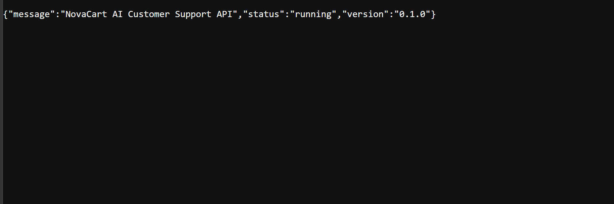
*Figure: FastAPI server active and listening on port 8000.*

### Step 3: Start Frontend Development Server
In a separate terminal window:

```bash
cd frontend
npm run dev
```
Open your browser and navigate to: `http://localhost:5173`

---

## 16. Testing

The repository includes a comprehensive test suite covering unit tests, integration workflows, fault resilience, and end-to-end conversation flows.

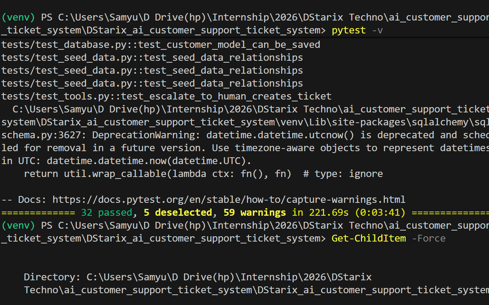
*Figure: Pytest execution showing 100% pass rate across test suites.*

### Running Tests with Pytest
```bash
# Run complete test suite
pytest

# Run with verbose output and console logging
pytest -v -s

# Run specific API integration tests
pytest tests/test_api_chat.py -v
```

### Verified Test Matrix (TC-01 through TC-13)

| Test ID | Scenario | Verification Focus | Tool / Component | Result |
| :---: | :--- | :--- | :--- | :---: |
| **TC-01** | General FAQ | Standard shipping duration query | `query_knowledge_base` | `PASS` |
| **TC-02** | Knowledge-Base Policy | Cancellation policy query | `query_knowledge_base` | `PASS` |
| **TC-03** | Refund Policy | 7-day return window inquiry | `query_knowledge_base` | `PASS` |
| **TC-04** | Order Status | Tracking inquiry for Order #45821 | `check_order_status` | `PASS` |
| **TC-05** | Payment Status | Transaction check for Order #45824 | `check_payment_status` | `PASS` |
| **TC-06** | Ticket Creation | Damaged item ticket request | `create_support_ticket` | `PASS` |
| **TC-07** | Human Escalation | Payment captured but order failed | Auto-Escalation Engine | `PASS` |
| **TC-08** | Unknown Question | Out-of-domain query guardrail | System Guardrail | `PASS` |
| **TC-09** | Invalid Order ID | Graceful error on Order #99999 | Database Boundary | `PASS` |
| **TC-10** | Tool Failure | System stability during tool exceptions | Fault Isolation | `PASS` |
| **TC-11** | Retrieval Failure | Fallback when vector search is down | Pure-Python Lexical Search | `PASS` |
| **TC-12** | Conversation Follow-up | Pronoun resolution across turns | LangGraph MemorySaver | `PASS` |
| **TC-13** | Session Isolation | Thread isolation across concurrent users | Memory Thread Isolation | `PASS` |

---

## 17. Error Handling

NovaCart AI incorporates defensive programming across all application boundaries to prevent crashes and ensure graceful degradation.

### 1. Invalid Order and Customer IDs
When a user supplies a non-existent order number (e.g., `99999`), the database returns `None`. The tool gracefully converts this into a structured error message (`"Order 99999 was not found"`), allowing the agent to request confirmation politely without throwing unhandled 500 exceptions.

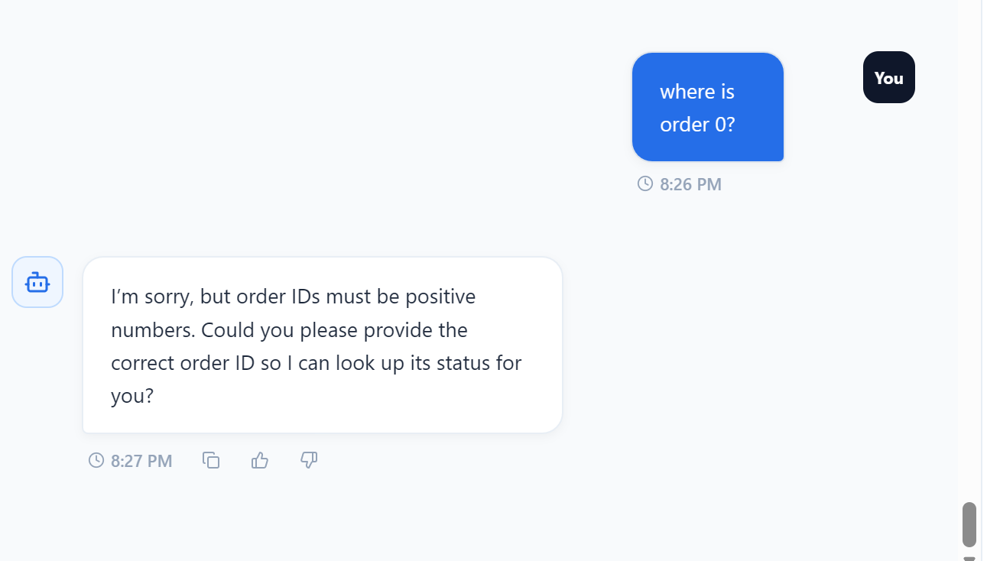
*Figure: Graceful response when customer provides a non-existent Order ID.*

### 2. Knowledge Retrieval Fault Tolerance
If vector database embeddings cannot be calculated or ChromaDB is temporarily unavailable, the retriever catches the exception and falls back to lexical search over the raw markdown files.

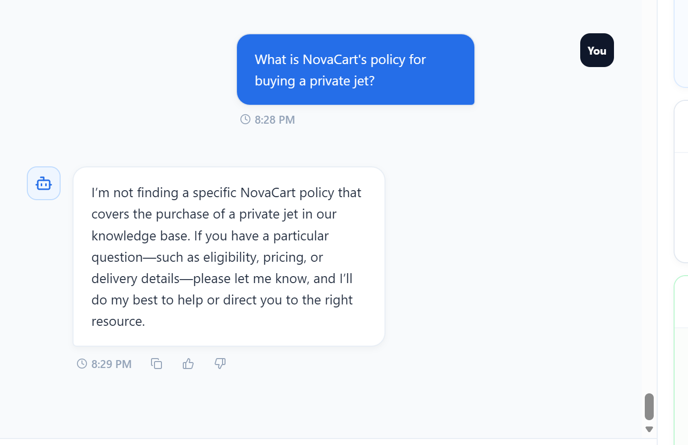
*Figure: System boundaries and fallback handling during policy search.*

### 3. Business Logic Anomaly Handling
When transactional discrepancies occur—such as an order marked `Cancelled` or `Failed` despite payment confirmation—the agent detects the inconsistency and initiates escalation.

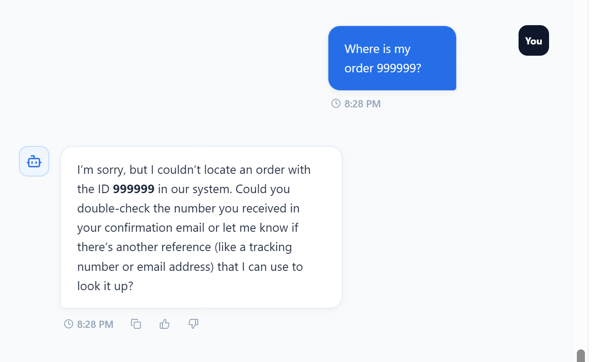
*Figure: Intelligent anomaly detection prompting escalation for conflicting transaction states.*

### 4. LLM API Rate Limits & Network Outages
External Groq API failures are wrapped in custom `AgentLLMError` exceptions. The API layer catches these errors and responds with standard HTTP 503 Service Unavailable codes and customer-friendly explanations rather than raw stack traces.

---

## 18. Known Limitations

* **In-Memory Checkpointer**: The active LangGraph checkpointer uses `MemorySaver()`, which persists state in application memory during execution. While full conversation histories are saved in SQLite, active LangGraph graph states reset when the FastAPI server restarts.
* **CPU Embedding Overhead**: Generating HuggingFace embeddings locally avoids third-party API dependencies, but bulk document ingestion on resource-constrained CPUs can take several seconds.
* **Single-Currency Assumption**: Order and payment pricing models are currently formatted for Indian Rupees (INR / ₹) without multi-currency conversion.
* **Context Window Boundaries**: Extended conversation sessions exceeding 40 turns do not currently implement automatic sliding-window summarization, which may lead to higher token consumption.

---

## 19. Future Improvements

* [ ] **Distributed Persistence**: Upgrade from `MemorySaver` to `PostgresSaver` or Redis checkpointers to support horizontal scaling across multi-container deployments.
* [ ] **Streaming Responses (SSE / WebSockets)**: Implement Server-Sent Events (SSE) to stream Groq LLM tokens to the UI in real time.
* [ ] **Hybrid RAG Retrieval**: Combine ChromaDB dense vector embeddings with BM25 sparse keyword indices using Reciprocal Rank Fusion (RRF) for optimal search precision.
* [ ] **Multimodal Defect Inspection**: Allow customers to upload photos of damaged goods directly in the chat, using vision models (e.g., Llama-3.2-Vision) to assess damage severity before ticket creation.
* [ ] **External CRM Connectors**: Implement direct webhook synchronization with ticketing platforms like Zendesk, Freshdesk, and Jira Service Management.
* [ ] **Multilingual Support**: Add automated translation middleware to handle customer inquiries in Hindi, Spanish, and other regional languages.